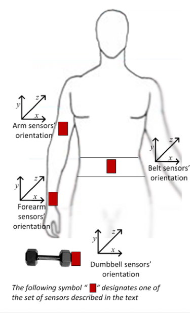

```{r setup, include=FALSE}
knitr::opts_chunk$set(echo = TRUE, cache = TRUE)
library(sqldf)
library(caret)
library(dplyr)
library(knitr)
library(kableExtra)
```

## Introduction
The Weight Lifting Excercise Dataset (WLWD, Velloso et al., 2013) was used to train a machine learning algorithm. The aim was to predict five different classes of the Unilateral Dumbbell Biceps Curl exercise. The WLWD has information about six participants performing the curl exercise in five different fashions. One of these fashions was the correct form of the movement, whereas the other four fashions were common mistakes people make in doing this exercise. A set of wearable sensors was used to track the movement of the arm, the forearm, the belt, and the dumpbell (see Figure 1). These data were used to train a Random Forest algorithm to recognize the different fashions in which participants displayed the exercise. The out-of-sample overall accuracy of the model is 96%.

<center>
{ width=25% height=25% }

## The Weight Lifting Excercise Dataset
The raw data can be efficiently downloaded from the internet using R's *sqldf* package. The raw dataset contains 19,622 observations across 160 variables.
```{r downloadData}
link = "https://d396qusza40orc.cloudfront.net/predmachlearn/pml-training.csv"
raw.dat = read.csv.sql(link, sql = "select * from file") 
dim(raw.dat)
```
  
The data is preprocessed to get rid of variables that do not include relevant information. A big assumption made here is that the data is time independent, even though it is probably not. This assumption is made because I do not consider there is not enough information to use the time stamps in the dataset. The processed dataset contains only 54 variables.
  
## Preprocess
```{r preprocess}
dat = raw.dat %>% mutate(user = user_name %>% gsub('"', "", .) %>% factor, 
               activity = classe %>% factor) %>% 
      select_if(function(x) class(x) != "character") %>%
      select(-contains("timestamp"), -num_window)
dim(dat)
```
  
### Partitioning data into training and testing sets
The data is split into two sets, a training set with 70% of observations and a test set with 30%.
  
```{r partition}
set.seed(80537)
trainSet = createDataPartition(dat$activity, list = F, p = .7)
training = dat[trainSet, ]
testing = dat[-trainSet, ]
dim(training)
dim(testing)
```
  
### Explatory analysis of activity features
The different activities produce distinct data across the sensors. For instance, Figure 2 shows how the belt information looks different across the five activities for two participants, Carlitos and Pedro.
```{r featPlot, fig.cap="Figure 2. Roll Belt Data", fig.align="center", fig.width=10, fig.height=4}
library(sm)
par(mfrow = c(1, 2))
training[which(training$user == "pedro"), "roll_belt"] %>%
  sm.density.compare(training[which(training$user == "pedro"), "activity"])
title(main = "Pedro's roll_belt")
legend("topright", legend = training$activity %>% unique, col = 1:5, lty = 1:5)
training[which(training$user == "carlitos"), "roll_belt"] %>%
  sm.density.compare(training[which(training$user == "carlitos"), "activity"])
title(main = "Carlito's roll_belt")
legend("topright", legend = training$activity %>% unique, col = 1:5, lty = 1:5)
```

### Reduce Dimensionality via PCA
A Principal Components Analysis (PCA) is ran on the training set to reduce the number of features for the learner algorithm. A PCA decomposes the variance of the original matrix in decreasing order so that the most variance is included within the first few components. Using the *pca* algorithm in the *caret* package, only 18 components are kept to capture 90% of the variance from the original 52 numeric variables. To see if a further reduction in the number of feature is possible, the features' variance is explored. However, there are no features with near zero variance within the PCA matrix. 
```{r pca}
(pc = preProcess(training, method = "pca", thresh = .9))
trainPC = predict(pc, training)
(nzv = nearZeroVar(trainPC))
```
  
Figure 3 shows the first two components effectively differentiate among the six participants.
```{r pcPlot, fig.cap="Figure 3. PCA differentiates users", fig.align="center"}
library(ggplot2)
g = ggplot(data = trainPC[, c(1, 3:4)], 
           aes(x = PC1, y = PC2, colour = user))
g + geom_point(alpha = .2)
```

## Model Training
A Random Forest (RF) model is selected to train the learner algorithm using a parallel implementation included in the *ParallelForest* package. To optimize the parameters of the learner algorithm, a 10-fold cross-validation approach is used.
```{r model}
library(doParallel)
registerDoParallel(cores=8)
train_control = trainControl(method = "cv", number = 10)
tic = proc.time()
set.seed(80537)
model = train(activity ~ ., 
               data = trainPC, 
               method = "parRF", 
               trControl = train_control)
toc = proc.time()
```
  
Even with parallel implementation, which uses the 8 cores in my laptop, the RF algorithm takes about `r round((toc[3] - tic[3])/60, 2)` minutes to finish. Results from the cross-validation analysis are shown in Table 1. The accuracy of the RF learner is really good, about `r paste0((model$results[2, 2] %>% round(2)) * 100, "%")`.

```{r cv}
model$results %>% 
        kable(caption = "Table 1. 10-Fold Cross-Validation RF Accuracy", 
              format = "html", digits = 2, align = "c") %>%
        kable_styling(bootstrap_options = c("striped", "hover", "responsive"),
                      full_width = F)
```
  
## Predicting Activity in Test Set  
With the aim of estimating the out-of-sample accuracy of the model, the RF learner was used to predict the activity classes in the testing set. Results can be seen in Table 2. 
```{r predict}
testPC = predict(pc, testing)
pred = predict(model, testPC %>% select(-activity))
CM = confusionMatrix(pred, testing$activity)
CM$table %>% 
        kable(caption = "Table 2. Out-of-Sample Accuracy", 
              format = "html", digits = 2, align = "c") %>%
        kable_styling(bootstrap_options = c("striped", "hover", "responsive"),
                      full_width = F)
```
  
The overall out-of-sample accuracy is `r paste0((CM$overall[1] %>% round(2)) * 100, "%")`, which is outstanding.

## Conclusion
The goal of this project was to predict the manner in which a user executes the Curl exercise. The learner, a Random Forest algorithm, was trained in 70% of the data, and has a good cross-validation accuracy (96%). Even more remarkable, the RF learner has a 97% out-of-sample accuracy--i.e., the accuracy of the algorithm when applied to the testing set. Researchers and developers can make use of this technique to consider ways in which gym users can be automatically supported to execute the correct movements during their workout.  
  
## Reference
Velloso, E.; Bulling, A.; Gellersen, H.; Ugulino, W.; Fuks, H. Qualitative Activity Recognition of Weight Lifting Exercises. Proceedings of 4th International Conference in Cooperation with SIGCHI (Augmented Human '13) . Stuttgart, Germany: ACM SIGCHI, 2013.
